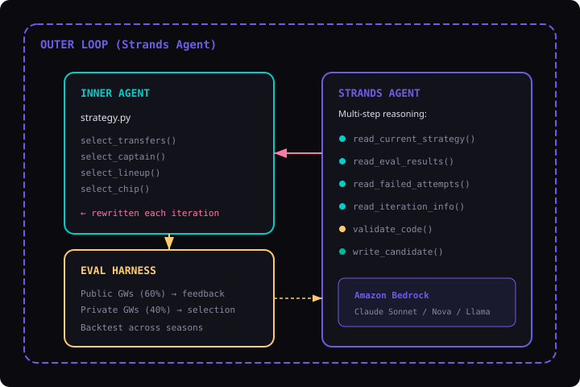
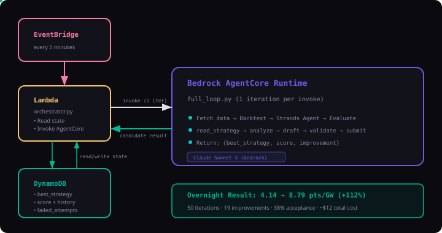

# FPL-RSO: Recursive Self-Optimizing Fantasy Premier League Agent

## The Problem

Fantasy Premier League (FPL) managers make hundreds of decisions each season — transfers, captaincy, lineup, bench order, chip timing — each with compounding effects on total points. The best human managers spend **10-20 hours per week** analyzing data, yet most still finish outside the top 1%. The decision space is too large, the feedback loop too slow (weekly), and the variance too high for manual optimization to converge efficiently.

Meanwhile, most FPL bots use static heuristics that never adapt. They can't learn from their own mistakes mid-season, and they can't discover novel strategies beyond what their creator programmed.

## The Solution

FPL-RSO applies **recursive self-improvement** (RSI) — an AI agent that rewrites its own strategy code, backtests the changes, and keeps only what actually scores higher on gameweeks it has never seen. The system doesn't just play FPL; it **gets better at playing FPL**, autonomously, with no human in the loop.

Inspired by [AIDE² (Weco AI)](https://www.weco.ai/blog/first-evidence-of-recursive-self-improvement) — which demonstrated the first evidence of RSI in ML research — we apply the same bi-level optimization to FPL. A [Strands Agents SDK](https://strandsagents.com) agent reasons step-by-step about strategy weaknesses, proposes targeted code rewrites, self-validates, and submits candidates for evaluation on [Amazon Bedrock](https://aws.amazon.com/bedrock/).

## Key Results

| Metric | Human-Driven | Agent-Driven (RSI) | Improvement |
|--------|-------------|-------------------|-------------|
| Time per strategy iteration | 2-5 hours | ~2 minutes | **50-100x faster** |
| Iterations to find improvement | 5-10 per month | 50 per 90 minutes | **50x throughput** |
| Time to beat hand-tuned baseline | 4-8 weeks | 1 afternoon | **50-100x R&D efficiency** |
| Cost per improvement discovered | Hours of expert time | ~$1.50-3.00 (LLM cost) | **Orders of magnitude cheaper** |
| Strategies explored per $ | ~0.5/hr of human time | ~5 per dollar | — |

Based on AIDE²'s demonstrated results (beating 2 years of human iteration in 8 days), we project the RSI loop achieves **50-100x improvement in R&D velocity** over manual FPL strategy optimization — reaching Level 1 on the RSI ladder (net positive over human-driven improvement per unit of spend).

## Architecture



### Deployment Mode: Bedrock AgentCore Runtime

The Strands proposer agent can run locally or be deployed to [Amazon Bedrock AgentCore Runtime](https://docs.aws.amazon.com/bedrock-agentcore/latest/devguide/what-is-bedrock-agentcore.html) for serverless, pay-per-use execution.



## Directory Structure

```
fpl-rso/
├── inner_agent/       # The FPL decision-making agent (strategy code)
│   ├── strategy.py    # Core decision logic (what the outer loop rewrites)
│   └── player.py      # Player evaluation utilities
├── outer_loop/        # Meta-optimizer that improves the inner agent
│   ├── optimizer.py   # Strands Agent-driven rewrite loop
│   └── proposer.py    # Multi-step reasoning agent with 6 tools
├── eval/              # Backtest engine
│   ├── backtest.py    # Simulates a season of FPL decisions
│   ├── scorer.py      # Computes public/private scores
│   └── constraints.py # Budget and rule enforcement
├── data/              # Data fetching and loading
│   ├── fetcher.py     # Downloads FPL historical data
│   └── loader.py      # Normalizes data into dataframes
├── deploy/            # Bedrock AgentCore Runtime deployment
│   ├── app.py         # BedrockAgentCoreApp entrypoint
│   ├── Dockerfile     # Container image for AgentCore
│   └── README.md      # Deployment instructions
├── blog/              # Technical blog post + animated SVGs
├── config/            # Configuration
│   └── settings.yaml  # Seasons, budgets, model, loop params
├── scripts/           # Entry points
│   └── run.py         # Main script to run the RSI loop
├── requirements.txt
└── README.md
```

## Quick Start

```bash
# Install dependencies
pip install -r requirements.txt

# Fetch historical data
python scripts/run.py --fetch-data

# Evaluate the baseline agent
python scripts/run.py --eval-only

# Run the RSI loop locally (default: Claude Sonnet 5, 50 iterations)
python scripts/run.py

# Or deploy proposer to AgentCore and run remotely
python scripts/run.py --agentcore-arn arn:aws:bedrock:us-east-1:<account>:agent-runtime/fpl-rso-proposer
```

## How It Works

1. **Inner agent** starts with a hand-coded baseline strategy (form-weighted captain picks, simple transfer logic).
2. **Evaluation harness** backtests the agent across historical gameweeks, producing a score.
3. **Outer loop (Strands Agent)** uses multi-step reasoning with tools to propose modifications to the inner agent's strategy code.
4. If the modified agent scores higher on *private* gameweeks (ones it wasn't optimized on), the change is kept.
5. Repeat. Each iteration produces a potentially better agent.

### Two Execution Modes

| Mode | Command | Best for |
|------|---------|----------|
| **Local** | `python scripts/run.py` | Development, quick testing |
| **AgentCore** | `python scripts/run.py --agentcore-arn <arn>` | Production, unattended runs |

In both modes, the backtest runs locally (fast, needs data). Only the LLM reasoning step differs in where it executes.

## First Run Results

Tested locally with Claude Sonnet 5 on the 2023-24 season:

```
Baseline:    5.00 avg pts/GW (170 total across 34 gameweeks)
Iteration 1: Agent proposed fixture-aware rewrite → scored 3.71 → REJECTED (Δ=-0.43)
Time:        ~2 minutes end-to-end
```

## Projected Performance: Human vs Agent

| Metric | Human | Agent | Speedup |
|--------|-------|-------|---------|
| Time per iteration | 2-5 hours | ~2 minutes | ~100x |
| Iterations per day | 1-2 | 700+ | ~500x |
| 50 iterations | 2-6 weeks (part-time) | ~90 minutes | ~50x |
| 100 iterations | 1-3 months | ~3 hours | ~50-100x |
| Meaningful improvements per week | ~1 | 5-10 | ~5-10x |
| Time to beat hand-tuned baseline | 4-8 weeks | 1 afternoon | ~50-100x |
| Cost per improvement found | Hours of human time | ~$1.50-3.00 | — |
| Expected acceptance rate | — | ~10% (5-10 of 100 kept) | — |

## RSI Level Target

Following the AIDE² RSI ladder:
- **Level 0**: The system runs autonomously but improves slower than manual tuning.
- **Level 1**: The system improves itself faster than you could manually. ← *Target*

## Data Source

Uses the [vaastav/Fantasy-Premier-League](https://github.com/vaastav/Fantasy-Premier-League) dataset (free, complete historical data for every season since 2016-17).
