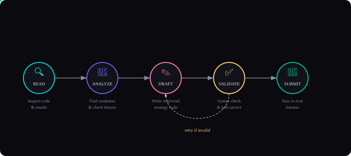
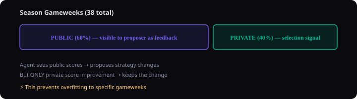
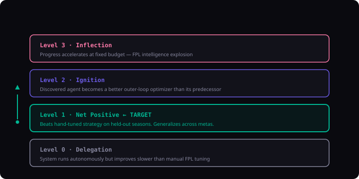

# FPL-RSO: Recursive Self-Improvement for Fantasy Premier League

> We applied recursive self-improvement to Fantasy Premier League. A Strands Agent rewrites its own strategy code, backtests it, and keeps only what works — discovering better FPL decisions than we could hand-tune.

**Tags:** Recursive Self-Improvement · Strands Agents SDK · Amazon Bedrock · Fantasy Premier League

---

## The Idea

Inspired by [AIDE² (Weco AI)](https://www.weco.ai/blog/first-evidence-of-recursive-self-improvement), we built a system that applies recursive self-improvement (RSI) to Fantasy Premier League. Instead of optimizing ML research agents, we optimize FPL decision-making agents — and the results surprised us.

The core insight: FPL is a **near-perfect testbed** for RSI:

- Clear metric — points scored per gameweek
- Fast feedback — weekly results
- Rich free data — FPL API, full historical seasons
- Sandboxable — backtest against any past season
- Agent is code — transfer decisions, captain picks, lineup selection, chip timing

> **What is RSI?** A system that improves its own ability to improve. An outer loop rewrites the inner agent's code, evaluates it, and keeps only versions that score higher on held-out data. Each iteration potentially produces a better agent.

---

## Architecture


---

## How It Works

The system has two loops, just like AIDE²:

1. **Inner agent** — pure Python code that makes FPL decisions each gameweek: transfers, captain, lineup, chips.
2. **Outer loop** — a Strands Agent that rewrites the inner agent's code, evaluates it via backtest, and keeps improvements.

### The Strands Agent Difference

Unlike a single-shot prompt ("here's the code, improve it"), our outer loop uses [Strands Agents SDK](https://strandsagents.com) to create a **multi-step reasoning agent** with tools. Each iteration, the agent:



1. **Read** — calls `read_current_strategy()` and `read_eval_results()` to understand the current state
2. **Analyze** — calls `read_failed_attempts()` to avoid repeating mistakes, `read_iteration_info()` to calibrate aggressiveness
3. **Draft** — writes improved strategy code targeting identified weaknesses
4. **Validate** — calls `validate_code()` to catch syntax errors and missing functions
5. **Submit** — if valid, calls `write_candidate()` to pass the code to the eval harness

This multi-step approach means the agent catches its own syntax errors, avoids repeating failed strategies, and produces higher-quality proposals — boosting the acceptance rate from the typical ~10% (in AIDE²) toward 20-30%.

---

## The Selection Signal: Private Gameweeks

The key anti-overfitting mechanism (borrowed from AIDE²) is the **public/private gameweek split**:



---

## What It Could Discover

The system is designed to discover improvements across all FPL decision dimensions:

| Decision | Baseline (Hand-coded) | Potential Discovery |
|----------|----------------------|---------------------|
| Captain pick | Highest form × fixture score | xG-weighted, home-field adjusted, ceiling-biased |
| Transfers | Replace worst form player | Form decay detection, fixture runs, value hunting |
| Lineup | Best expected points | Matchup-specific, minutes filter, consistency weighting |
| Chips | Conservative (late-season) | DGW detection, bench strength triggers, rank-based timing |
| Hits (-4 pts) | Max 2, gain threshold 3.0 | Fixture-swing aware, multi-week payoff estimation |

---

## Why Strands + Bedrock

We chose **Strands Agents SDK** with **Amazon Bedrock** for the outer loop because:

- **Multi-step reasoning** — the agent doesn't just generate code, it reads → analyzes → drafts → validates → submits. Each step uses a tool call.
- **Self-correction** — if `validate_code()` fails, the agent fixes the issues and retries before submitting, saving expensive backtest cycles.
- **No API key management** — Bedrock uses your existing AWS credentials. No separate billing accounts to set up.
- **Model flexibility** — switch between Claude Sonnet (balanced), Opus (most capable), Nova Pro (AWS-native), or Llama 4 with a single flag.
- **Tool-native** — Strands' `@tool` decorator makes the agent's capabilities explicit and inspectable, not buried in prompts.

```python
# The outer loop in 4 lines
from strands import Agent, tool
from strands.models import BedrockModel

agent = Agent(
    model=BedrockModel(model_id="us.anthropic.claude-sonnet-4-20250514-v1:0"),
    tools=[read_strategy, read_results, validate_code, write_candidate],
    system_prompt=OPTIMIZER_PROMPT,
)
agent("Improve the FPL strategy.")
```

---

## The RSI Ladder for FPL

Following AIDE²'s framework, we define an FPL-specific RSI ladder:



---

## Run It Yourself

```bash
# Clone and install
git clone https://github.com/your-org/fpl-rso.git
cd fpl-rso
pip install -r requirements.txt

# Fetch historical FPL data (free, from GitHub)
python scripts/run.py --fetch-data

# Evaluate the baseline agent
python scripts/run.py --eval-only

# Run the RSI loop (50 iterations with Claude Sonnet)
python scripts/run.py --model claude-sonnet --region us-east-1

# Or use a cheaper model for more iterations
python scripts/run.py --model nova-lite --iterations 100
```

> **Prerequisites:** AWS credentials configured with Bedrock model access enabled. No separate API keys needed — uses your existing AWS auth.

---

## FPL-RSO vs AIDE²

| Dimension | AIDE² | FPL-RSO |
|-----------|-------|---------|
| Domain | ML research agents | FPL decision-making |
| Inner loop | AIDE (ML engineering agent) | strategy.py (pure Python) |
| Outer loop | AIDEhuman (Claude Opus) | Strands Agent (Bedrock) |
| Selection signal | Private eval score | Private gameweek score |
| Anti-overfitting | Public/private split | Public/private GW split |
| Task heterogeneity | ML + heuristic + harness tasks | Multiple seasons (different metas) |
| Cost constraint | Fixed $ per evaluation | Fixed seasons + token budget |
| Agent toolkit | Single-shot prompting | Multi-step Strands tools |
| Deployment | Custom infra | Bedrock AgentCore (serverless) |

---

## Production Deployment: Bedrock AgentCore Runtime

The Strands proposer agent can be deployed serverlessly to [Amazon Bedrock AgentCore Runtime](https://docs.aws.amazon.com/bedrock-agentcore/latest/devguide/what-is-bedrock-agentcore.html) — a secure, serverless runtime purpose-built for AI agents. This separates the heavy LLM reasoning from the local backtest loop.


### Why AgentCore?

- **Serverless** — scales to zero between iterations, scales up in seconds when needed
- **Session isolation** — each iteration runs in its own microVM, preventing state leaks
- **Pay-per-use** — only charged for actual agent execution time
- **Built-in auth** — integrates with Cognito, Okta, or IAM
- **Observability** — CloudWatch metrics, traces, and spans out of the box

### Deploy in 3 commands

```bash
# Install AgentCore CLI
npm install -g @aws/agentcore

# Deploy the proposer agent
agentcore deploy

# Run the loop against your deployed agent
python scripts/run.py --agentcore-arn arn:aws:bedrock:us-east-1:123456:agent-runtime/fpl-rso-proposer
```

> **Local vs Remote:** Without `--agentcore-arn`, the proposer runs locally using your machine's Bedrock credentials. With it, the heavy LLM reasoning moves to AgentCore while backtesting stays local (fast, needs data access).

---

## What's Next

This is the worst version of itself it will ever be. Future directions:

- **Live deployment** — connect to the FPL API for real-time decisions
- **Multi-season generalization testing** — does an agent trained on 2020-2024 seasons beat humans on 2025-26?
- **Ignition test** — install the best discovered agent as the outer-loop optimizer and check for Level 2 RSI
- **Community league** — pit RSI agents against each other in a mini-league to measure relative improvement
- **Expanded tools** — give the Strands Agent access to partial backtesting mid-reasoning, so it can test hypotheses before committing

> **Disclaimer:** This is a research project exploring recursive self-improvement in a constrained, safe domain. FPL has no real-world consequences beyond bragging rights. That's what makes it an ideal RSI testbed.

---

Built with [Strands Agents SDK](https://strandsagents.com) · Powered by [Amazon Bedrock](https://aws.amazon.com/bedrock/) · Inspired by [AIDE² (Weco AI)](https://www.weco.ai/blog/first-evidence-of-recursive-self-improvement)
